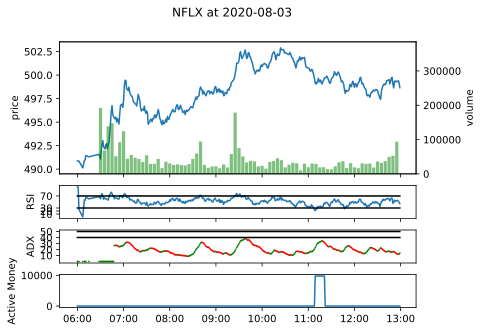
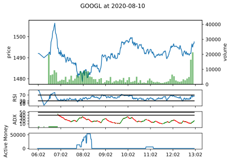
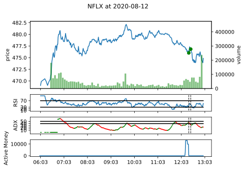
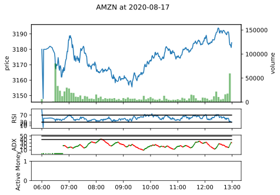
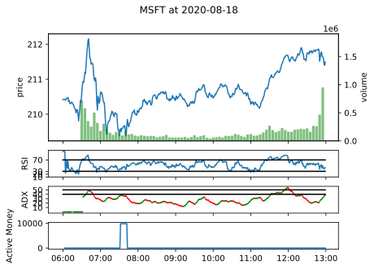
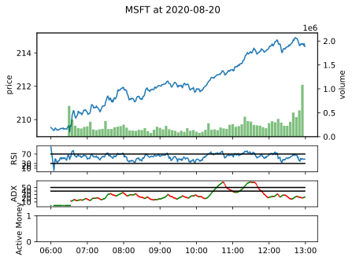
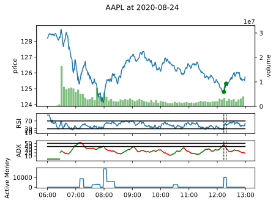
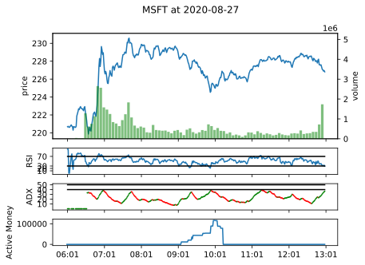
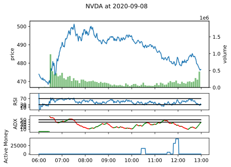

## Profits 

| DATE | TSLA | AAPL | QQQ | NVDA | ROKU | NFLX | TQQQ | MSFT | GOOGL | ASML | AMZN | TOTAL |
| ------- | ------- | ------- | ------- | ------- | ------- | ------- | ------- | ------- | ------- | ------- | ------- | ------- |
| 2020-08-03 | 75.77 | 0.00 | 0.00 | 0.00 | 0.00 | 0.00 | 0.00 | 0.00 | 0.00 | 0.00 | 0.00 | 75.77 |
| 2020-08-04 | 0.00 | 8.51 | 0.00 | 0.00 | 0.00 | 0.00 | 30.38 | 0.00 | 0.00 | 0.00 | 13.84 | 52.72 |
| 2020-08-05 | 0.00 | 0.00 | 0.00 | 0.00 | 0.00 | 0.00 | 0.00 | 0.00 | 0.00 | 0.00 | 0.00 | 0.00 |
| 2020-08-06 | 0.00 | 0.00 | 0.00 | 31.40 | 50.40 | 0.00 | 0.00 | 0.00 | 0.00 | 0.00 | 0.00 | 81.81 |
| 2020-08-07 | -9.78 | -12.47 | 28.53 | -26.92 | 34.18 | -10.45 | -20.67 | 31.48 | 0.00 | 25.51 | 0.00 | 39.42 |
| 2020-08-10 | 105.12 | 0.00 | 36.72 | 104.81 | 98.32 | 15.66 | 111.79 | 16.78 | 0.00 | 29.83 | 0.00 | 519.04 |
| 2020-08-11 | 0.00 | 26.81 | 0.00 | 0.00 | 0.00 | 0.00 | 0.00 | 0.00 | 0.00 | 0.00 | 44.46 | 71.27 |
| 2020-08-12 | 0.00 | 0.00 | 0.00 | 0.00 | 16.92 | 17.08 | 0.00 | 0.00 | 0.00 | 0.00 | 0.00 | 34.00 |
| 2020-08-13 | 0.00 | 0.00 | 16.11 | 0.00 | 0.00 | 0.00 | 51.21 | 1.79 | 0.00 | 0.00 | 0.00 | 69.11 |
| 2020-08-14 | 0.00 | 0.00 | 0.00 | 0.00 | 0.00 | 0.00 | 0.00 | 0.00 | 0.00 | 0.00 | 0.00 | 0.00 |
| 2020-08-17 | 0.00 | 0.00 | 0.00 | 0.00 | 0.00 | 0.00 | 0.00 | 0.00 | 0.00 | 0.00 | 0.00 | 0.00 |
| 2020-08-18 | 0.00 | 0.00 | 0.00 | 0.00 | 0.00 | 0.00 | 0.00 | 0.00 | 0.00 | 24.31 | 0.00 | 24.31 |
| 2020-08-19 | 0.00 | 0.00 | 14.40 | 13.75 | 35.54 | 4.65 | 37.74 | 24.21 | 0.00 | 11.25 | 0.00 | 141.53 |
| 2020-08-20 | 0.00 | 0.00 | 0.00 | 0.00 | 0.00 | 0.00 | 0.00 | 0.00 | 0.00 | 0.00 | 0.00 | 0.00 |
| 2020-08-21 | 15.25 | 18.54 | 0.00 | 0.00 | 0.00 | 0.00 | 0.00 | 5.86 | 0.00 | 0.00 | 0.00 | 39.66 |
| 2020-08-24 | 0.00 | 41.40 | 35.00 | 0.00 | 0.00 | 46.44 | 221.98 | -9.66 | 0.00 | 0.00 | 83.66 | 418.81 |
| 2020-08-25 | 0.00 | 0.00 | 0.00 | 0.00 | 0.00 | 0.00 | 0.00 | 0.00 | 0.00 | 0.00 | 0.00 | 0.00 |
| 2020-08-26 | 68.39 | 0.00 | 29.09 | 56.08 | 0.00 | 0.00 | 86.45 | 0.00 | 0.00 | 0.00 | 0.00 | 240.00 |
| 2020-08-27 | -12.31 | 58.80 | -51.00 | 9.65 | 65.68 | 0.00 | -170.25 | 0.00 | 0.00 | 18.98 | 17.45 | -63.00 |
| 2020-08-28 | -22.27 | 0.00 | 0.00 | 0.00 | 0.00 | 0.00 | 0.00 | 0.00 | 0.00 | 0.00 | 0.00 | -22.27 |
| 2020-08-31 | 0.00 | 0.00 | 0.00 | 0.00 | 0.00 | 0.00 | 0.00 | 0.00 | 0.00 | 0.00 | 0.00 | 0.00 |
| 2020-09-01 | 9.61 | 0.00 | 0.00 | 0.00 | 0.00 | 0.00 | 0.00 | 12.65 | 0.00 | 0.00 | 0.00 | 22.25 |
| 2020-09-02 | 506.75 | 200.88 | 26.48 | 0.00 | 0.00 | 0.00 | 73.70 | 0.00 | 0.00 | 0.00 | 0.00 | 807.81 |
| 2020-09-03 | 13.56 | 0.00 | 86.87 | 117.29 | 0.00 | 0.00 | 275.66 | -120.39 | 41.02 | 65.19 | -38.52 | 440.69 |
| 2020-09-04 | 0.00 | 0.00 | -65.19 | 0.00 | 137.35 | 198.70 | -264.37 | -16.29 | 0.00 | -52.79 | 0.00 | -62.59 |
| 2020-09-08 | 0.00 | 0.00 | 10.98 | 0.00 | 13.95 | 55.72 | 36.81 | 14.68 | 0.00 | 0.00 | 0.00 | 132.13 |
| 2020-09-09 | 0.00 | 0.00 | 0.00 | 0.00 | 0.00 | -31.14 | 0.00 | 0.00 | 0.00 | 0.00 | 0.00 | -31.14 |
| 2020-09-10 | 0.00 | -25.77 | 44.34 | 3.14 | 82.15 | 19.65 | 1.88 | 63.93 | 0.00 | 0.00 | 4.70 | 194.02 |
| 2020-09-11 | 0.00 | 0.00 | 0.00 | 62.17 | -22.26 | 0.00 | 0.00 | 32.55 | 0.00 | 0.00 | 0.00 | 72.45 |
| sum | 750.09 | 316.69 | 212.34 | 371.37 | 512.23 | 316.30 | 472.30 | 57.58 | 41.02 | 122.29 | 125.58 | 3297.80 |
## Plots

### 2020-08-03

           

### 2020-08-04

           

### 2020-08-05

           

### 2020-08-06

           

### 2020-08-07

           

### 2020-08-10

           

### 2020-08-11

           

### 2020-08-12

           

### 2020-08-13

           

### 2020-08-14

           

### 2020-08-17

           

### 2020-08-18

           

### 2020-08-19

           

### 2020-08-20

           

### 2020-08-21

           

### 2020-08-24

           

### 2020-08-25

           

### 2020-08-26

           

### 2020-08-27

           

### 2020-08-28

           

### 2020-08-24

           

### 2020-08-25

           

### 2020-08-26

           

### 2020-08-27

           

### 2020-08-28

           

### 2020-08-31

           

### 2020-09-01

           

### 2020-09-02

           

### 2020-09-03

           

### 2020-09-04

           

### 2020-09-08

           

### 2020-09-09

           

### 2020-09-10

           

### 2020-09-11

           

